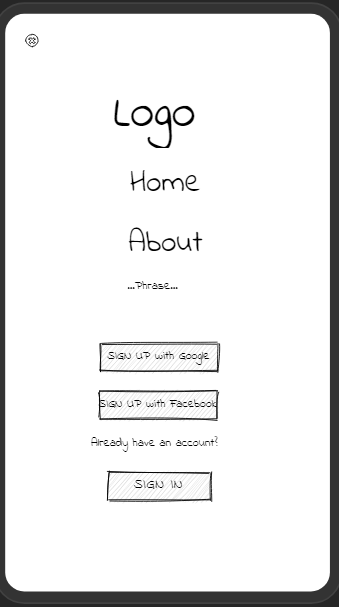
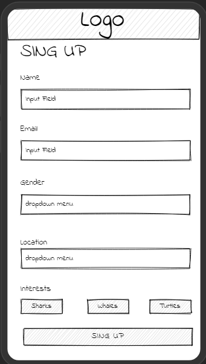
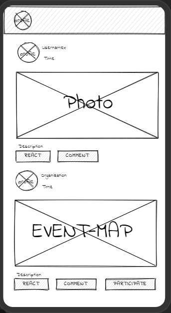
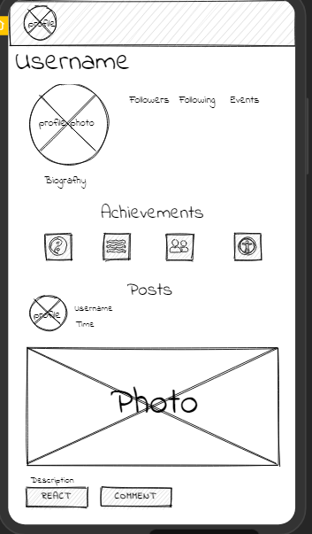

# Diseño UX para una futura APP

date: 15/05/2022 

Como planes a futuro se planeo diseñar una apliacion web tipo red social 

Para ello sera necesario el usurio cree su perfil con datos como:  nombres, email, ubicación, intereses, etc.

Una vez creada la cuenta el usuario entrara a una pagina principal donde podra enterarse de los posts de las personas que sigue y proximos eventos de interes, ya sea por zona o actividad
Por eso es que al momento de registro se le pide que ingrese sus intereses, para poder proporcionar eventos relacionados con sus gustos

Con la cuenta creada el usuario tendra un perfil y en dicho perfil el usuario podra visualizar sus followers, following y los eventos realizados
Una forma de destacar a cada usuario es el hecho de que en sus perfil se podra observar medallas las cuales son producto de participar en diferentes eventos 

Esta sección del proyecto a futuro tiene la finalidad de combatir la desinformación y el desinteres de las personas, es por eso que la red social motivará a los usuarios a compartir sus experiencias y de esa forma motivar a otros a que se sumen a este tipo de causas.

